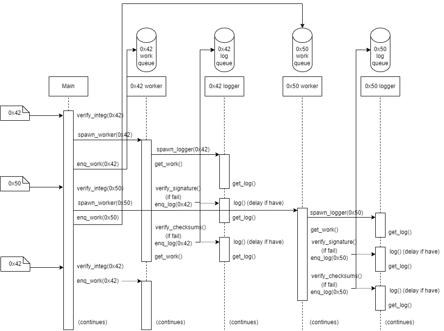

# UDP Server - CRC32 Packet Processor

## Overall
This package contains the implementation of a UDP server. It supports concurrent
processing and validating
digital signature and repeating key XOR'd cyclic checksum CRC32 DWORDS of
incoming UDP packet. The user can also specify a delay (in seconds) to the
logging of validation failures to file.

## Features
This UDP server and its implementation sports the following features.

### Efficient concurrent handling of packets
This server spawns worker threads to handle validation of digital signature and
cyclic checksums of packets. Therefore, the server will be able to handle
multiple packets of different `packet_id` at the same time, allowing for more
packets to be received and processed.

### Efficient Cyclic Checksum CRC32 calculations
This server stores previous cylic checksum iteration in `FileChecksums` object,
allowing for a swift calculation of CRC32 of an entire binary file of
a large number of cyclic iteration.

### Efficient and non-blocking delayed logging
Utilizing a separate logger thread for each `packet_id`, the server will be
able to handle delayed logging without blocking cylic checksums calcullation and
validation. The details of this feature is specified in [Logger thread](#logger-thread)
of the [Design](#design) section.


## Prerequisites
This package was implemented and tested extensively in **Python 3.11.8**.

## Running
This package is run through the command line.

1) Change directory to the root directory of this project
```
cd <project's directory>
```

2) Install packages
```
pip install -r requirements.txt
```

3) Command line arguments
The main entry point for this server is `server.py`.

- `--keys`: a dictionary of `{packet_id: key_file_path}` mappings
- `--binaries`: a dictionary of `{packet_id: binary_path}` mappings
- `--delay (-d)`: delay, (in seconds) for writing to log files
- `--port (-p)`: port, to receive packets on

Example run:
```
  python server.py --keys '{"0x42": "key.bin"}' --binaries '{"0x42": "cat.jpg"}' -d '0' -p '1337'
```


## Packet Specifications
```
====================================================================
( 4 bytes ) Unique Packet ID for the checksummed binary
====================================================================
( 4 bytes ) Packet Sequence # (Total Checksums Processed)
====================================================================
( 2 bytes ) Multibyte Repeating XOR Key | ( 2 bytes ) # of Checksums
====================================================================
( Variable ) Repeating key XOR'd Cyclic Checksum CRC32 DWORDs
....
....
....
====================================================================
( 64 bytes ) RSA 512 SHA-256 Digital Signature (for above fields)
====================================================================
```

## Server Design

Here is the design diagram of the UDP server:

### Main thread

Upon starting, the thread will preprocess the given public keys and binaries.
It will also create two `logging.Logger` objects, one for `verification_failures.log`
and one for `checksum_failures.log`, to assist with logging to file later.
Everything will be packed in a `ServerConfig` object and the server will start
up on the given address and port ready for service.

NOTICE: Due to the limited implementation and time, the server will only take
in a packet with size at most `4096` bytes.

Upon receing a packet, the server will check for its content and verify against
the packet specification. Once everything is valid, the server will be able to
extract its `packet_id`, packet sequence number, multibyte repeating XOR key,
number of checksums, its checksum DWORDS, and its digital signature. With the
`packet_id`, the server will assign that packet to the work queue of the thread
handling the other two verifications. If the thread handling that has not been
spawned yet, the server will do it upon seeing a new `packet_id`.


### Worker thread

Upon spawning, the worker will initialize its companion logger thread that will
help the worker log to file when needed. This need for a logger thread
arises due to the log delaying feature, so the worker can continue working
when the logger handles the delaying.

Each worker will be responsible for processing the signature and checksums
validation for packets containing the `packet_id` that it was assigned to.
The worker will receive its work (packet) from its asigned work queue. If the
queue is empty, the queue will block the execution until a packet comes in for
processing.

### Logger thread

The design for this logger thread is an interesting one. We know that logs will
come in sequentially, which means that the order of the log request in the queue
will be chronological. This is because this logger is only servering one worker
thread, and because each worker thread processes only one packet at a given time,
it is certain that the log requests will be chronological. Using this property,
we can just take one log request from the queue, wait out the delay (if any),
and continue with another logging request.

## Limitations
The author recognizes the following limitations of this UDP server design and
implementation.

### Lack support for packets with size more than 4096 bytes
Due to the nature of UDP packets, the entire size of the packet is not known,
or at least is not supported in Python's `server` module. There is one way,
however, that we can retrieve the entire packet. Since the number of checksums
are given, we can use that to calculate how big the entire packet is overall.
Upon receiving the first 4096 bytes of the packet, we can calculate the size
of the incoming packet, and continue requesting more if necessary. However,
due to time constraint, the author has not been able to implement this yet.

### Inefficient storage and calculation of CRC32 cyclic checksums iteration
In this implementation, cyclic checksums iterations are calculated by storing
previous iterations in a list of the `FileChecksums` object. This means that
this server can only support verifying checksums of cyclic iteration of up to
however big the Python's `List` can store. There are ways of mitigating this
storage, for example, storing only a limited number of checksums iteration
(e.g. every 1000 iteration), and calculating from the closest point to the
desired iteration.

### Lack support for packet sequence header overflow
The packet sequence number has only 4 bytes, which means the server can support
a sequence number of up to 4,294,967,295.

### Python's GIL means limited multithreading capabilities
Due to Python's Global Interpreter Lock, which prevents multiple threads
from executing Python bytecode at the same time. This means that Python does not
have true multithreading.This prevents this server from supporting a lot of
unique `packet_id`s, since more `packet_id`s means more threads, and since
Python does not support true multithreading, this will create performance
problems in the long run.

### Other multithreading and concurrency problems
The author admits having limited knowledge in concurrency and distributed systems.
(I have only taken Computer Organizations and Parallel & Disributed Systems in
college, and limited practical experience, aside from this project, of course).
There might be other problems related to multiprocessing or multithreading
that this server does not support and the author admits limitations to this.

